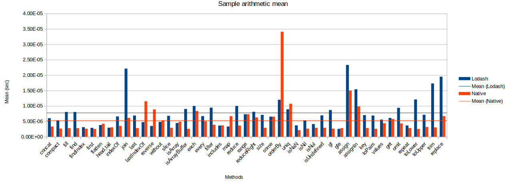

# Prefer native JS methods over user-land utils like Lodash


<br/><br/>

### One Paragraph Explainer

Sometimes, using native methods is better than requiring `lodash` or `underscore` because it will not lead in a performance boost and use more space than necessary.
The performance using native methods result in an [overall ~50% gain](https://github.com/Berkmann18/NativeVsUtils/blob/master/analysis.xlsx) which includes the following methods: `Array.concat`, `Array.fill`, `Array.filter`, `Array.map`, `(Array|String).indexOf`, `Object.find`, ...


<!-- comp here: https://gist.github.com/Berkmann18/3a99f308d58535ab0719ac8fc3c3b8bb-->

<br/><br/>

### Example: benchmark comparison - Lodash vs V8 (Native)
The graph below shows the [mean of the benchmarks for a variety of Lodash methods](https://github.com/Berkmann18/NativeVsUtils/blob/master/nativeVsLodash.ods), this shows that Lodash methods take on average 146.23% more time to complete the same tasks as V8 methods.



### Code Example – Benchmark test on `_.concat`/`Array.concat`
```javascript
const _ = require('lodash'),
  __ = require('underscore'),
  Suite = require('benchmark').Suite,
  opts = require('./utils'); //cf. https://github.com/Berkmann18/NativeVsUtils/blob/master/utils.js

const concatSuite = new Suite('concat', opts);
const array = [0, 1, 2];

concatSuite.add('lodash', () => _.concat(array, 3, 4, 5))
  .add('underscore', () => __.concat(array, 3, 4, 5))
  .add('native', () => array.concat(3, 4, 5))
  .run({ 'async': true });
```

Which returns this:


You can find a bigger list of benchmarks [here](https://github.com/Berkmann18/NativeVsUtils/blob/master/index.txt) or alternatively [run this](https://github.com/Berkmann18/NativeVsUtils/blob/master/index.js) which would show the same but with colours.

### Blog Quote: "You don't (may not) need Lodash/Underscore"

From the [repo on this matter which focuses on Lodash and Underscore](https://github.com/you-dont-need/You-Dont-Need-Lodash-Underscore).

 > Lodash and Underscore are great modern JavaScript utility libraries, and they are widely used by Front-end developers. However, when you are targeting modern browsers, you may find out that there are many methods which are already supported natively thanks to ECMAScript5 [ES5] and ECMAScript2015 [ES6]. If you want your project to require fewer dependencies, and you know your target browser clearly, then you may not need Lodash/Underscore.

### Example: Linting for non-native methods usage
There's an [ESLint plugin](https://www.npmjs.com/package/eslint-plugin-you-dont-need-lodash-underscore) which detects where you're using libraries but don't need to by warning you with suggestions (cf. example below).<br>
The way you set it up is by adding the `eslint-plugin-you-dont-need-lodash-underscore` plugin to your ESLint configuration file:
```json
{
  "extends": [
    "plugin:you-dont-need-lodash-underscore/compatible"
  ]
}
```

### Example: detecting non-v8 util usage using a linter
Consider the file below:
```js
const _ = require('lodash');
// ESLint will flag the line above with a suggestion
console.log(_.map([0, 1, 2, 4, 8, 16], x => `d${x}`));
```
Here's what ESLint would output when using the YDNLU plugin.


Of course, the example above doesn't seem realistic considering what actual codebases would have but you get the idea.
