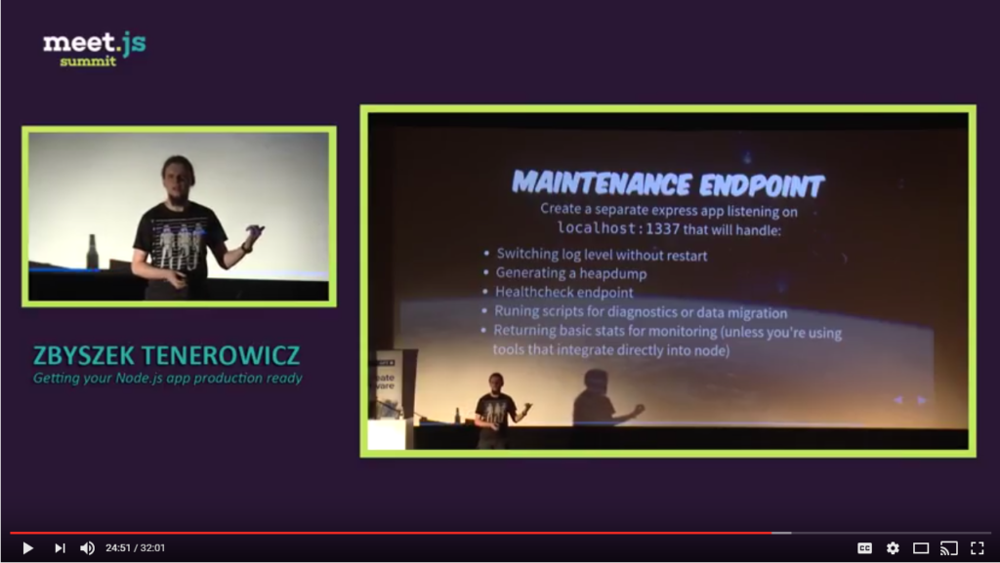

# Create a maintenance endpoint

<br/><br/>

### One Paragraph Explainer

A maintenance endpoint is a highly secure HTTP API that is part of the app code and its purpose is to be used by the ops/production team to monitor and expose maintenance functionality. For example, it can return a heap dump (memory snapshot) of the process, report whether there are some memory leaks and even allow to execute REPL commands directly. This endpoint is needed where the conventional DevOps tools (monitoring products, logs, etc) fail to gather some specific type of information or you choose not to buy/install such tools. The golden rule is using professional and external tools for monitoring and maintaining the production, these are usually more robust and accurate. That said, there are likely to be cases where the generic tools will fail to extract information that is specific to Node or to your app – for example, should you wish to generate a memory snapshot at the moment GC completed a cycle – few npm libraries will be glad to perform this for you but popular monitoring tools will likely miss this functionality. It is important to keep this endpoint private and accessibly only by admins because it can become a target of a DDOS attack.

<br/><br/>

### Code example: generating a heap dump via code

```javascript
const heapdump = require('heapdump');

// Check if request is authorized 
function isAuthorized(req) {
    // ...
}

router.get('/ops/heapdump', (req, res, next) => {
    if (!isAuthorized(req)) {
        return res.status(403).send('You are not authorized!');
    }

    logger.info('About to generate heapdump');

    heapdump.writeSnapshot((err, filename) => {
        console.log('heapdump file is ready to be sent to the caller', filename);
        fs.readFile(filename, "utf-8", (err, data) => {
            res.end(data);
        });
    });
});
```

<br/><br/>

### Recommended Resources

[Getting your Node.js app production ready (Slides)](http://naugtur.pl/pres3/node2prod)

▶ [Getting your Node.js app production ready (Video)](https://www.youtube.com/watch?v=lUsNne-_VIk)


