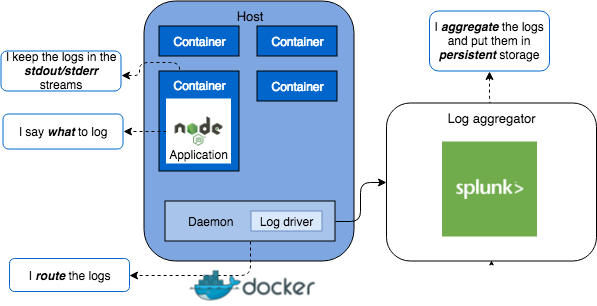

# Kod aplikacji nie powinien obsługiwać routingu dziennika

<br/><br/>

### Wyjaśnienie jednym akapitem

Kod aplikacji nie powinien obsługiwać routingu dziennika, ale zamiast tego powinien używać narzędzia logger do pisania w `stdout / stderr`. „Log routing” oznacza pobieranie i przekazywanie dzienników do innej lokalizacji niż aplikacja lub proces aplikacji, na przykład zapisywanie dzienników w pliku, bazie danych itp. Powód tego jest w większości dwojaki: 1) separation of concerns oraz 2) [12-Factor best practices for modern applications](https://12factor.net/logs).

Często myślimy o "separation of concerns" jeśli chodzi o fragmenty kodu między usługami i między samymi usługami, ale dotyczy to również komponentów bardziej „infrastrukturalnych”. Twój kod aplikacji nie powinien obsługiwać czegoś, co powinno być obsługiwane przez infrastrukturę / środowisko wykonawcze (najczęściej obecnie kontenery). Co się stanie, jeśli zdefiniujesz lokalizacje dzienników w aplikacji, ale później będziesz musiał zmienić tę lokalizację? Powoduje to zmianę kodu i wdrożenie. Podczas pracy z platformami opartymi na kontenerach / chmurach kontenery mogą się obracać i zamykać podczas skalowania do wymagań wydajności, więc nie jesteśmy pewni, gdzie skończy się plik dziennika. Środowisko wykonawcze (kontener) powinno decydować, do którego miejsca kierowane są pliki dziennika. Aplikacja powinna po prostu zarejestrować to, czego potrzebuje do `stdout` /` stderr`, a środowisko wykonawcze powinno być skonfigurowane tak, aby pobierało strumień dziennika stamtąd i kierowało go tam, gdzie musi się udać. Ponadto członkowie zespołu, którzy muszą określić i / lub zmienić miejsca docelowe dziennika, często nie są programistami aplikacji, ale są częścią DevOps i mogą nie znać kodu aplikacji. Zapobiega to łatwym wprowadzaniu zmian.

<br/><br/>

### Przykład kodu - Antywzorzec: routing dziennika jest ściśle powiązany z aplikacją

```javascript
const { createLogger, transports, winston } = require('winston');
/**
   * Requiring `winston-mongodb` will expose
   * `winston.transports.MongoDB`
   */
require('winston-mongodb');
 
// log to two different files, which the application now must be concerned with
const logger = createLogger({
  transports: [
    new transports.File({ filename: 'combined.log' }),
  ],
  exceptionHandlers: [
    new transports.File({ filename: 'exceptions.log' })
  ]
});
 
// log to MongoDB, which the application now must be concerned with
winston.add(winston.transports.MongoDB, options);
```
Robiąc to w ten sposób, aplikacja obsługuje teraz zarówno logikę aplikacji / biznesu ORAZ logikę routingu dziennika!

<br/><br/>

### Przykład kodu - Lepsza obsługa dziennika + przykład Docker
W aplikacji:
```javascript
const logger = new winston.Logger({
  level: 'info',
  transports: [
    new (winston.transports.Console)()
  ]
});

logger.log('info', 'Test Log Message with some parameter %s', 'some parameter', { anything: 'This is metadata' });
```
Następnie, w kontenerze dockera `daemon.json`:
```json5
{
  "log-driver": "splunk", // just using Splunk as an example, it could be another storage type
  "log-opts": {
    "splunk-token": "",
    "splunk-url": "",
    //...
  }
}
```
Ten przykład wygląda mniej więcej tak `log -> stdout -> Docker container -> Splunk`

<br/><br/>

### Cytat z Bloga: "O'Reilly"

Z [O'Reilly blog](https://www.oreilly.com/ideas/a-cloud-native-approach-to-logs),
 > When you have a fixed number of instances on a fixed number of servers, storing logs on disk seems to make sense. However, when your application can dynamically go from 1 running instance to 100, and you have no idea where those instances are running, you need your cloud provider to deal with aggregating those logs on your behalf.

<br/><br/>

### Cytat: "12-Factor"

Z [12-Factor best practices for logging](https://12factor.net/logs),
 > A twelve-factor app never concerns itself with routing or storage of its output stream. It should not attempt to write to or manage logfiles. Instead, each running process writes its event stream, unbuffered, to stdout.
 
 > In staging or production deploys, each process’ stream will be captured by the execution environment, collated together with all other streams from the app, and routed to one or more final destinations for viewing and long-term archival. These archival destinations are not visible to or configurable by the app, and instead are completely managed by the execution environment.

<br/><br/>

 ### Przykład: Przegląd architektury na przykładzie Docker i Splunk



<br/><br/>
