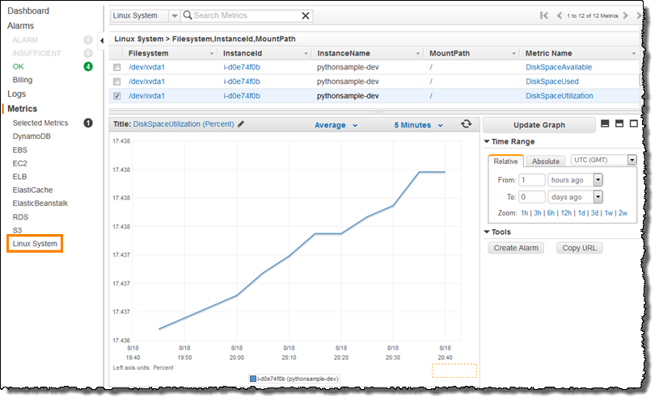
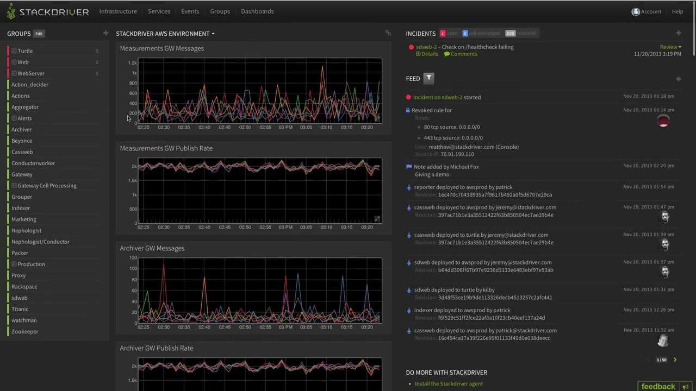
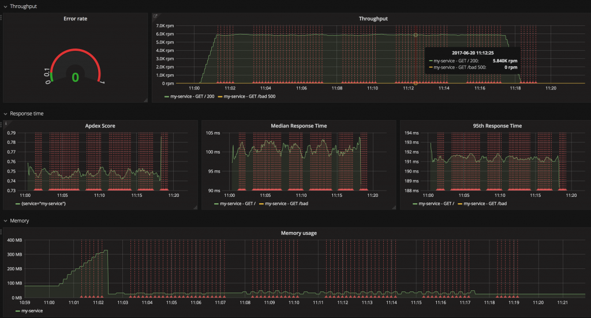

# Monitoramento!

  

### Explicação em um Parágrafo

No nível básico, monitoramento significa que você pode *facilmente* identificar quando coisas ruins acontecem na produção. Por exemplo, ao ser notificado por email ou Slack. O desafio é escolher o conjunto certo de ferramentas que satisfarão suas necessidades sem quebrar seu banco. Posso sugerir, comece definindo o conjunto principal de métricas que devem ser observadas para garantir um estado íntegro - CPU, RAM do servidor, RAM do processo do Node (menos de 1,4 GB), o número de erros no último minuto, o número de reinícios do processo, tempo médio de resposta. Em seguida, analise alguns recursos avançados que você pode gostar e adicione-os à sua lista de desejos. Alguns exemplos de um recurso de monitoramento de luxo: criação de perfil de banco de dados, medição de serviço cruzado (isto é, medição de transação comercial), integração front-end, expor dados brutos a clientes de BI personalizados, notificações do Slack e muitos outros.

Atingir os recursos avançados exige uma configuração demorada ou a compra de um produto comercial como Datadog, NewRelic e similares. Infelizmente, alcançar até mesmo o básico não é um passeio no parque, pois algumas métricas são relacionadas ao hardware (CPU) e outras vivem dentro do processo do Node (erros internos), portanto, todas as ferramentas simples requerem alguma configuração adicional. Por exemplo, soluções de monitoramento de fornecedores de nuvem (por exemplo, [AWS CloudWatch](https://aws.amazon.com/cloudwatch/), [Google StackDriver](https://cloud.google.com/stackdriver/)) informarão imediatamente sobre as métricas de hardware, mas não sobre o comportamento interno da aplicação. Por outro lado, soluções baseadas em log, como o ElasticSearch, não possuem a visualização de hardware por padrão. A solução é aumentar sua escolha com métricas ausentes, por exemplo, uma opção popular é enviar logs de aplicativos para o [Elastic stack](https://www.elastic.co/products) e configurar alguns agentes adicionais (por exemplo, [Beat](https://www.elastic.co/products)) para compartilhar informações relacionadas ao hardware para obter a imagem completa.

  

### Exemplo de monitoramento: painel padrão do AWS cloudwatch. Difícil de extrair métricas na aplicação

  

### Exemplo de monitoramento: painel padrão do StackDriver. Difícil de extrair métricas na aplicação

  

### Exemplo de monitoramento: Grafana como camada de interface do usuário que visualiza dados brutos

  

### O que Outros Blogueiros Dizem

Do blog [Rising Stack](https://blog.risingstack.com/node-js-performance-monitoring-with-prometheus/):

> …Recomendamos que você observe esses sinais para todos os seus serviços:
> Taxa de erros: porque os erros são enfrentados pelo usuário e afetam imediatamente seus clientes.
> Tempo de resposta: porque a latência afeta diretamente seus clientes e negócios.
> Taxa de transferência: o tráfego ajuda você a entender o contexto de taxas de erro aumentadas e a latência também.
> Saturação: Diz quão “completo” é o seu serviço. Se o uso da CPU for de 90%, seu sistema pode lidar com mais tráfego? …
