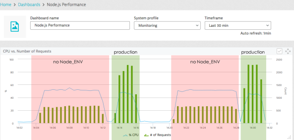

# 配置环境变量 NODE_ENV = production

<br/><br/>


### 一段解释

进程的环境变量是一组键值对，可用于任何运行程序，通常用于配置。虽然可以使用其他任何变量，但Node鼓励使用一个名为NODE_ENV的变量来标记我们是否正在开发。这一决定允许组件在开发过程中能提供更好的诊断，例如禁用缓存或发出冗长的日志语句。任何现代部署工具 — Chef、Puppet、CloudFormation等 — 在部署时都支持设置环境变量。

<br/><br/>


### 代码实例：配置和读取NODE_ENV环境变量

```javascript
//在启动node进程前，在bash中设置环境变量
$ NODE_ENV=development
$ node
 
//使用代码读取环境变量
If(process.env.NODE_ENV === “production”)
    useCaching = true;
```

<br/><br/>


### 其他博主说了什么
摘自这篇博客[dynatrace](https://www.dynatrace.com/blog/the-drastic-effects-of-omitting-node_env-in-your-express-js-applications/):
> ...在node.js中有一个约定， 它使用名为NODE_ENV的变量来设置当前工作模式。我们看到它实际上是读取NODE_ENV，如果它没有设置，则默认为“development”。我们清楚的看到，通过设置NODE_ENV为production，node.js可以处理请求的数量可以提高大约三分之二，而CPU的使用率会略有下降。 *让我强调一下:设置NODE_ENV为production可以让你的应用程序快3倍!*





<br/><br/>

