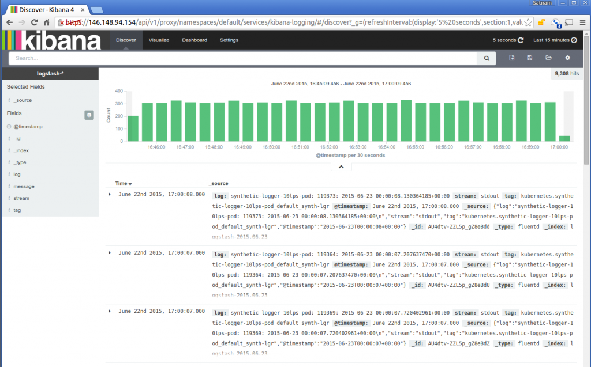

# Uczyń swoją aplikację przejrzystą za pomocą inteligentnych dzienników

  

### Wyjaśnienie jednym akapitem

Ponieważ i tak drukujesz instrukcje dziennika i oczywiście potrzebujesz interfejsu, który zawija informacje produkcyjne, w których możesz śledzić błędy i podstawowe dane (np. ile błędów występuje co godzinę i który jest twój najwolniejszy punkt końcowy interfejsu API), dlaczego nie inwestować umiarkowanych wysiłków w solidne ramy rejestrowania, które zaznaczą wszystkie pola? Osiągnięcie tego wymaga przemyślanej decyzji w trzech krokach:

**1. smart logging** – co najmniej musisz korzystać z renomowanej biblioteki rejestrowania, takiej jak [Winston](https://github.com/winstonjs/winston), [Bunyan](https://github.com/trentm/node-bunyan) i pisać istotne informacje na początku i na końcu każdej transakcji. Rozważ także sformatowanie instrukcji dziennika jako JSON i zapewnienie wszystkich właściwości kontekstowych (np. identyfikator użytkownika, typ operacji itp.), aby zespół operacyjny mógł działać na tych polach. Dołącz także unikalny identyfikator transakcji w każdym wierszu dziennika, aby uzyskać więcej informacji, patrz punkt poniżej „Zapisuj identyfikator transakcji do dziennika”. Ostatnim punktem, który należy wziąć pod uwagę, jest także agent rejestrujący zasoby systemowe, takie jak pamięć i procesor, takie jak Elastic Beat.

**2. smart aggregation** – po uzyskaniu wyczerpujących informacji o systemie plików serwerów nadszedł czas, aby okresowo przekazywać je do systemu, który agreguje, udostępnia i wizualizuje te dane. Na przykład Elastic stack jest popularnym i bezpłatnym wyborem, który oferuje wszystkie komponenty do agregowania i wizualizacji danych. Wiele komercyjnych produktów zapewnia podobną funkcjonalność, ale znacznie skraca czas instalacji i nie wymaga hostingu.

**3. smart visualization** – teraz informacje są agregowane i możliwe do przeszukiwania, można zadowolić się jedynie mocą łatwego przeszukiwania dzienników, ale może to pójść znacznie dalej bez kodowania lub nakładania dużego wysiłku. Możemy teraz wyświetlać ważne wskaźniki operacyjne, takie jak wskaźnik błędów, średni procesor w ciągu dnia, ilu nowych użytkowników wyraziło zgodę w ciągu ostatniej godziny oraz wszelkie inne dane, które pomagają zarządzać naszą aplikacją i ją ulepszać

  

### Przykład wizualizacji: Kibana (część Elastic stack) ułatwia zaawansowane wyszukiwanie zawartości dziennika

  

### Przykład wizualizacji: Kibana (część Elastic stack) wizualizuje dane na podstawie logów

  

### Cytat na blogu: Logger Requirements

Z bloga [Strong Loop](https://strongloop.com/strongblog/compare-node-js-logging-winston-bunyan/):

> Lets identify a few requirements (for a logger):
> 1. Timestamp each log line. This one is pretty self-explanatory – you should be able to tell when each log entry occurred.
> 2. Logging format should be easily digestible by humans as well as machines.
> 3. Allows for multiple configurable destination streams. For example, you might be writing trace logs to one file but when an error is encountered, write to the same file, then into error file and send an email at the same time…

  

  
