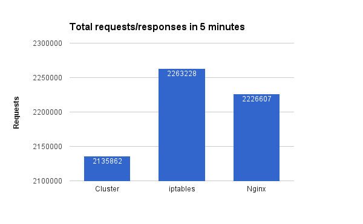

# Используйте все ядра процессора

  

### Объяснение в один абзац

Неудивительно, что в своей базовой форме Node работает над одним потоком = один процесс = один процессор. Плата за мощное оборудование с 4 или 8 процессорами и использование только одного звучит безумно, верно? Самое быстрое решение, которое подходит для приложений среднего размера, - это использование кластерного модуля Node, который из 10 строк кода порождает процесс для каждого логического ядра и направляет запросы между процессами в стиле циклического перебора. Более того, используйте PM2, который приукрашивает модуль кластеризации простым интерфейсом и отличным интерфейсом мониторинга. Хотя это решение хорошо работает для традиционных приложений, оно может не подходить для приложений, требующих первоклассной производительности и надежного потока DevOps. Для этих расширенных вариантов использования рассмотрите возможность репликации процесса NODE с использованием пользовательского сценария развертывания и балансировки с помощью специализированного инструмента, такого как nginx, или используйте механизм контейнеров, такой как AWS ECS или Kubernetees, которые имеют расширенные функции для развертывания и репликации процессов.

  

### Сравнение: балансировка с использованием кластера Node против nginx

  

### Что говорят другие блоггеры

* Из документации [Node.js documentation](https://nodejs.org/api/cluster.html#cluster_how_it_works):
> ... Второй подход, кластеры Node, должен, теоретически, дать лучшую производительность. На практике, однако, распределение имеет тенденцию быть очень несбалансированным из-за капризов планировщика операционной системы. Нагрузки наблюдались, когда более 70% всех соединений заканчивались всего двумя процессами из восьми ...

* Из блога [StrongLoop](https://strongloop.com/strongblog/best-practices-for-express-in-production-part-two-performance-and-reliability/):
> ... Кластеризация возможна с помощью кластерного модуля Node. Это позволяет главному процессу порождать рабочие процессы и распределять входящие соединения среди рабочих. Однако вместо того, чтобы использовать этот модуль напрямую, гораздо лучше использовать один из множества инструментов, которые делают это автоматически; например node-pm или cluster-service ...

* Из поста на Medium [Node.js process load balance performance: comparing cluster module, iptables, and Nginx](https://medium.com/@fermads/node-js-process-load-balancing-comparing-cluster-iptables-and-nginx-6746aaf38272)
> ... Кластер Node прост в реализации и настройке, все хранится в сфере Node, не завися от другого программного обеспечения. Просто помните, что ваш основной процесс будет работать почти так же, как ваши рабочие процессы, и с меньшей частотой запросов, чем другие решения ...
