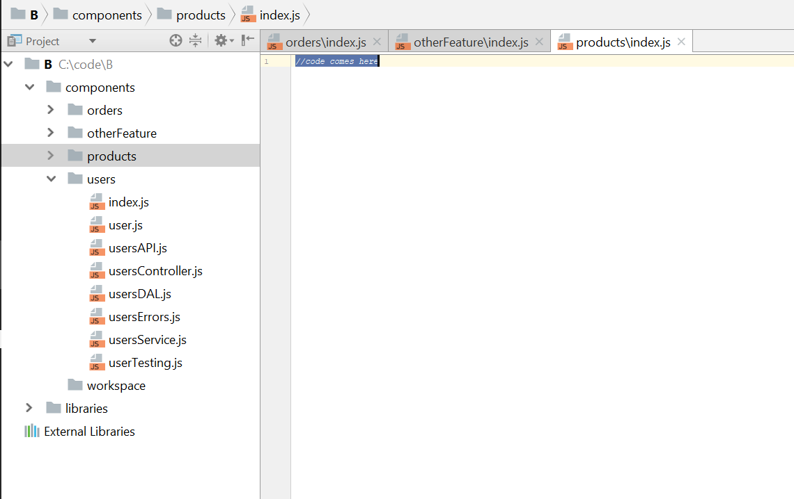

# Estruture sua solução por componentes
  

### Explicação em um Parágrafo

Para aplicações de tamanho médio e acima, os monólitos são muito ruins - ter um grande software com muitas dependências é difícil de avaliar e, muitas vezes, leva ao código de espaguete. Mesmo arquitetos inteligentes - aqueles que são habilidosos o suficiente para domar a fera e "modulá-la" - gastam muito esforço mental no projeto, e cada mudança requer uma avaliação cuidadosa do impacto em outros objetos dependentes. A solução final é desenvolver um software pequeno: dividir a pilha inteira em componentes independentes que não compartilham arquivos com outros, cada um constituindo poucos arquivos (por exemplo, API, serviço, acesso a dados, teste, etc.), de modo que é muito fácil de entender. Alguns podem chamar isso de arquitetura de 'microserviços' - é importante entender que os microsserviços não são uma especificação que você deve seguir, mas sim um conjunto de princípios. Você pode adotar muitos princípios em uma arquitetura completa de microsserviços ou adotar apenas alguns. Ambos são bons, desde que você mantenha baixa a complexidade do software. O mínimo que você deve fazer é criar bordas básicas entre os componentes, atribuir uma pasta na raiz do projeto para cada componente de negócios e torná-lo independente - outros componentes podem consumir sua funcionalidade somente por meio de sua interface pública ou API. Esta é a base para manter seus componentes simples, evitar o inferno de dependências e preparar o caminho para microsserviços completos no futuro, assim que seu aplicativo crescer.

  

### Citação de Blog: "O escalonamento requer escalonamento de todo o aplicativo"

 Do blog [MartinFowler.com](https://martinfowler.com/articles/microservices.html)

> Aplicações monolíticas podem ser bem-sucedidas, mas cada vez mais as pessoas estão sentindo frustrações com elas - especialmente à medida que mais aplicativos são implantados na nuvem. Os ciclos de mudança estão interligados - uma alteração feita em uma pequena parte do aplicativo requer que todo o monólito seja reconstruído e implantado. Ao longo do tempo, muitas vezes é difícil manter uma boa estrutura modular, tornando mais difícil manter as alterações que devem afetar apenas um módulo dentro desse módulo. O escalonamento requer escalonamento de todo o aplicativo, em vez de partes dele que exigem maior recurso.

  

### Citação de Blog: "Então, o que a arquitetura do seu aplicativo grita?"

 Do blog [uncle-bob](https://8thlight.com/blog/uncle-bob/2011/09/30/Screaming-Architecture.html) 

> ...se você estivesse olhando para a arquitetura de uma biblioteca, provavelmente veria uma grande entrada, uma área para funcionários de check-in-out, áreas de leitura, pequenas salas de conferência e galeria após galeria, capaz de guardar estantes de livros para todos os livros. a biblioteca. Essa arquitetura iria gritar: Biblioteca. 

Então, o que a arquitetura da sua aplicação grita? Quando você olha para a estrutura de diretório de nível superior e os arquivos de origem no pacote de nível mais alto; Eles gritam: sistema de saúde ou sistema de contabilidade ou sistema de gerenciamento de estoque? Ou eles gritam: Rails, ou Spring/Hibernate, ou ASP?.

  

### Bom: estruture sua solução por componentes independentes

  

### Ruim: Agrupe seus arquivos por papel técnico

